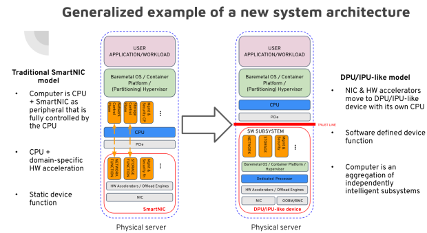

# **Diamond Bluff Vision Statement**

The objective of the Diamond Bluff initiative is to foster a community-driven
standards-based open ecosystem for next generation architectures and
frameworks based on DPU/IPU-like technologies.

# **Diamond Bluff Project Backgrounder**

A new class of cloud and datacenter infrastructure is emerging into the
marketplace. This new infrastructure element, often referred as Data Processing
Unit (DPU) or Infrastructure Processing Unit (IPU), takes the form of a server
hosted PCIe add-in card or on-board chip(s), containing one or more ASIC’s or
FPGA's, usually anchored around a single powerful SoC device. The DPU/IPU-like
devices have their roots in the evolution of SmartNIC devices but separate
themselves from that legacy in several important ways.

While a Smart NIC is clearly part of its host node’s compute system and exists
to closely interact with and offload node hosted applications, the DPU/IPU
dispenses with this secondary role. Instead, the DPU/IPU presents itself as a
complete compute system unto itself with the following key characteristics:

* Presence of their own general purpose processor
* The ability to boot a general purpose OS
* Domain-specific HW acceleration capabilities
* Software-defined device functions that allow the software components deployed
  to them to define the device's functions that are presented to the host
* Offloading of whole software subsystems, such as the Networking or Storage
  stack, including their control planes
* Strict security isolation from the host on the hardware-level
* Unique network identity
* Out-of-band management where the Data/Infrastructure Processing Unit
  (DPU/IPU)-like device is managed separately from the server where it resides
  or the DPU/IPU-like device can be used to manage the server

The new system architecture based on DPU/IPU is fully capable of running
independent software stacks and hosting its own applications using either
embedded or orchestrated deployment models (see the chart below). These unique
capabilities of the DPU/IPU are disruptive because they allow for key
infrastructure functions and their associated software stacks to be completely
removed from the host node’s CPU cores and to be relocated onto the DPU/IPU.
Network, storage, security, and virtualization functions are all ideal targets
for this relocation; in these cases the host cores become the exclusive domain
of the application workloads.

This arrangement solves multiple problems extant in current infrastructure. It
restores the separation of concerns between infrastructure and application and
solves an acute business problem for many enterprises. Specifically, the
infrastructure workloads, now executing on the DPU/IPU, are independently
managed by the Infrastructure, NetOps, and SecOps teams while the applications
can be managed by a DevOps team.

It prevents unexpected variations in the compute requirements of the
applications from interfering with the infrastructure services and vice-versa
while greatly simplifying node size estimation when provisioning and allocating
nodes at scale.

It facilitates the simplification of the network, storage, and security APIs
within the application, enabling more portable and performant applications,
while still delivering the full benefits of SDN overlays, remote storage
access, and in line encryption via the DPU/IPU infrastructure services.

It creates a security air gap between the untrusted host applications and the
infrastructure services. Virtualization control and crypto certificates are
kept on the DPU/IPU making it impossible for malware on the host node to
compromise the security of the hypervisor, the cloud’s underlying
infrastructure, or other hosted applications.

The proof of the power and leverage of an at scale DPU/IPU implementation has
been demonstrated by AWS with its Nitro technology. Nitro has allowed AWS to
secure, control, and manage its cloud infrastructure components and to even
create IaaS Bare Metal nodes, where customers' applications magically seem to
run directly on top of real metal hosts. But Nitro is a proprietary AWS
solution as are similar efforts by other hyperscale cloud providers. The
emerging DPU/IPU silicon and cards, offered as a merchant product, represent a
democratization of this advanced virtualization technology. Combined with the
right software stack, the advantages of the Nitro-like architecture can now be
realized by any organization or enterprise willing to build a private cloud
infrastructure around DPU/IPU technology.

But where will the right DPU/IPU software stack come from? And will it be a
closed, walled garden, single vendor offering? Or will it be an open,
collaborative, multi-vendor, innovation driven, ecosystem similar to what has
occurred with the Kubernetes and Container environments?

The Diamond Bluff project is being created to address these questions and to
foster the emergence of such an open and creative software eco-system for
DPU/IPU based cloud infrastructure. The project intends to delineate what a
DPU/IPU is, to loosely define a framework(s) and architecture for a
DPU/IPU-based software stack(s) applicable to any vendors hardware solution,
allowing the creation of a rich open source application ecosystem, to integrate
with existing open source projects aligned to the same vision such as the Linux
kernel and[ IPDK.io](https://ipdk.io) and create new APIs for interaction with
and between the elements of the DPU/IPU ecosystem:

* the DPU/IPU hardware
* DPU/IPU hosted applications
* the host Node
* remote provisioning software
* remote orchestration software
